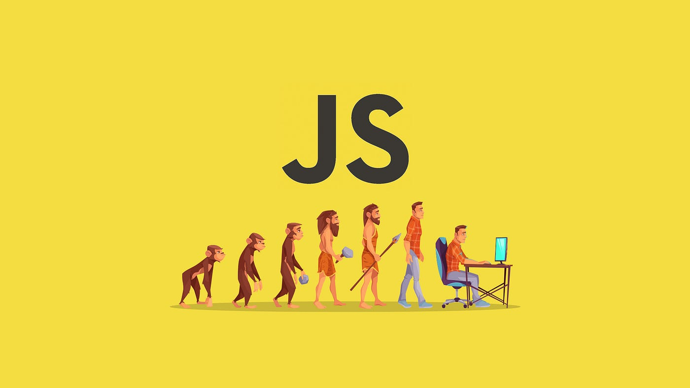

# Taller de Ejercicios JS
Este repositorio pretende dar respuesta a las preguntas del taller Taller#1 DOM del profesor Jossy Tello. La intension de este, es plasmar lo aprendido en clase. No pretende, ni es un sustituto de la preparación por tu cuenta.  
También te recomiendo que revises el material del curso, practiques con exámenes de práctica y pedir ayuda a un mentor o tutor si lo necesitas.  

## Contenido

|Taller#1 DOM (Nodos)|
|-----------|
|[Puntos 1, 2 & 3]()| 
|[Punto 4]()|
|[Punto 5]()|
|[Punto 6]()|
|[Punto 7]()|

